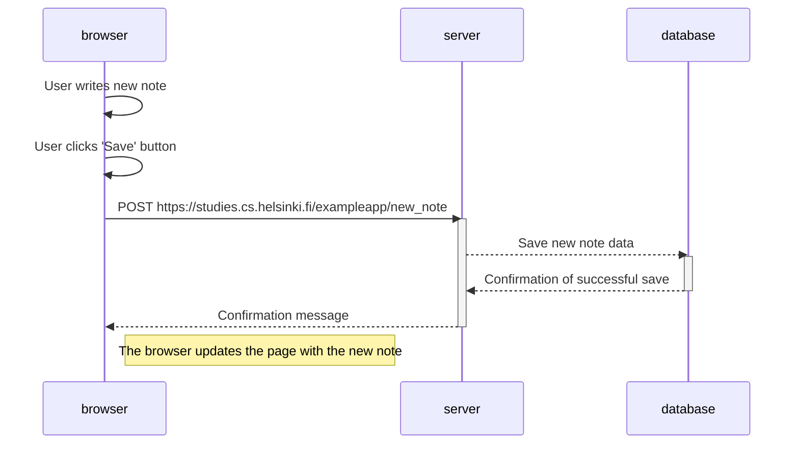

```mermaid
sequenceDiagram
    participant browser
    participant server
    participant database

    browser->>browser: User writes new note
    browser->>browser: User clicks 'Save' button
    browser->>server: POST https://studies.cs.helsinki.fi/exampleapp/new_note
    activate server
    server-->>database: Save new note data
    activate database
    database-->>server: Confirmation of successful save
    deactivate database
    server-->>browser: Confirmation message
    deactivate server

    Note right of browser: The browser updates the page with the new note
```
